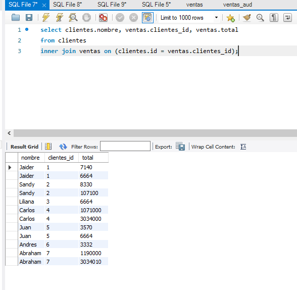
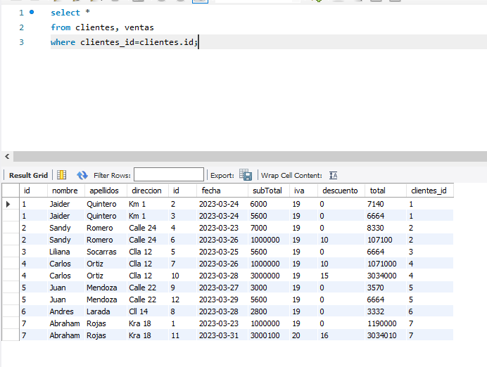
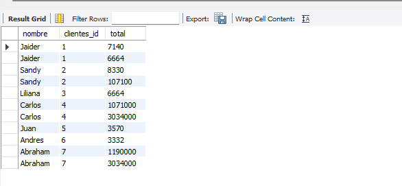

# ConsultasSQL
BD Tienda con las consultas pedidas por el profesor Jaider
---

### Consulta con el join 
```` sql
select clientes.nombre, ventas.clientes_id, ventas.total
from clientes
inner join ventas on (clientes_id=clientes.id);
````


---
### Consulta con el where
```` sql
select *
from clientes,ventas
where (clientes_id=clientes.id);
````


---
### Consulta de la compra de los clientes con where
```` sql
select clientes.*, ventas.total
from clientes,ventas
where clientes.id = ventas.clientes_id and (ventas.fecha between '2023-03-23' and '2023-03-25');
````


---
### Consulta de la compra de los clientes con join
```` sql
select clientes.*, ventas.clientes_id, ventas.total
from clientes
inner join ventas on (clientes.id = ventas.clientes_id)
where ventas.fecha between '2023-03-23' and '2023-03-25';
````


---
### Consulta de la compra de clientes con Left Join
```` sql
SELECT clientes.nombre, ventas.clientes_id, ventas.total
FROM clientes
LEFT JOIN ventas ON ventas.clientes_id = clientes.id;
````

